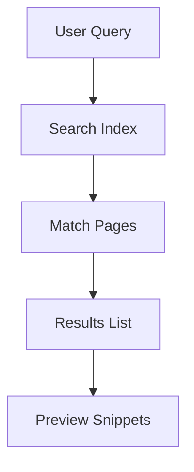

## Overview

Arseniy Finberg provides powerful features to streamline your documentation workflow. You organize content into structured projects, edit with rich formatting tools, track changes via version control, and enable easy search across your docs. These core capabilities help you maintain professional, up-to-date documentation for any project.

<Columns cols={3}>
  <Card title="Organize Projects" icon="folder" href="#organizing-documentation">
    Structure your docs into projects and sections for better navigation.
  </Card>
  <Card title="Rich Editing" icon="edit-3" href="#editing-and-formatting">
    Format content with Markdown, components, and previews.
  </Card>
  <Card title="Version History" icon="git-branch" href="#version-control">
    Track changes and revert to previous versions effortlessly.
  </Card>
</Columns>

## Organizing Documentation

You create projects to group related documentation and sections to subdivide content logically. This hierarchical structure improves navigation and discoverability.

<Steps>
  <Step title="Create a Project" icon="plus">
    Navigate to the dashboard and select **New Project**. Enter a name like `My API Docs` and a description.
  </Step>
  <Step title="Add Sections" icon="folder-plus">
    Inside the project, click **New Section**. Name it `Authentication` or `Quickstart`.
  </Step>
  <Step title="Add Pages" icon="file-plus">
    Within a section, create pages using the `+` button. Arseniy Finberg auto-generates the file like `features.mdx`.
  </Step>
</Steps>

<Callout kind="tip">
  Use nested sections for deep hierarchies, such as `API > Endpoints > Users`.
</Callout>

## Editing and Formatting Content

Arseniy Finberg supports rich editing with MDX, including JSX components, syntax highlighting, and live previews. You format text, embed code, and add interactive elements seamlessly.

<Tabs>
  <Tab title="Markdown Basics" icon="edit">
    Write standard Markdown for headings, lists, and links.

````markdown
## Heading

- List item
- Another item

`Inline code` for variables.
````
  </Tab>
  <Tab title="MDX Components" icon="code">
    Embed components like `<Callout>` for enhanced docs.

````jsx
<Callout kind="info">
  This is interactive content.
</Callout>
````
  </Tab>
  <Tab title="Code Examples" icon="terminal">
    Use fenced blocks for syntax highlighting.

````javascript
const apiKey = `YOUR_API_KEY`;
fetch(`https://api.example.com/users`, {
  headers: { Authorization: `Bearer ${apiKey}` }
});
````
  </Tab>
</Tabs>

## Version Control and History Tracking

Every edit creates a version snapshot. You view, compare, and revert changes directly in the editor, ensuring no content is lost.

<CodeGroup tabs="CLI,UI">
  ```bash
  # Pull latest changes
  git pull origin main

  # View history
  git log --oneline
  ```
  ```javascript
  // Programmatic history check
  const history = await fetch('/api/docs/history?file=features.mdx');
  console.log(history.versions);
  ```
</CodeGroup>

<Expandable title="Advanced Version Workflow" default-open="false">
  Integrate with Git for branching:

  ```
  git checkout -b feature/search-ui
  # Make edits
  git commit -m "Add search improvements"
  git push origin feature/search-ui
  ```
</Expandable>

## Search and Discovery

Built-in search indexes your content for full-text queries. You find pages by keywords, tags, or sections quickly.



<Callout kind="info">
  Tag pages with `{["feature", "guide"]}` for filtered searches.
</Callout>

## Next Steps

<Columns cols={2}>
  <Card title="Quickstart" icon="rocket" href="/quickstart">
    Set up your first project in minutes.
  </Card>
  <Card title="Advanced Editing" icon="settings" href="/advanced-editing">
    Dive into custom components and themes.
  </Card>
</Columns>