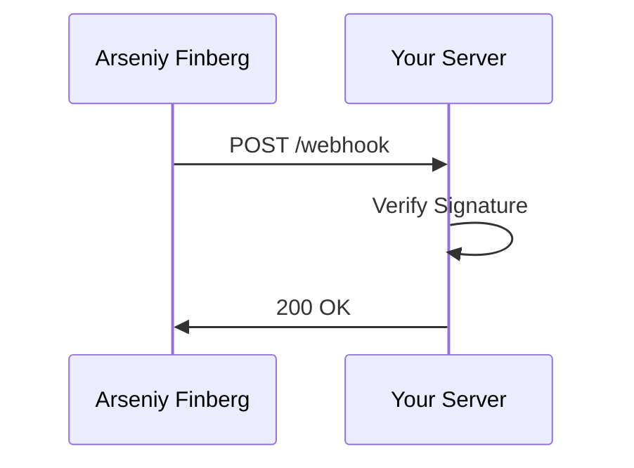

## Overview

Arseniy Finberg supports seamless integrations with popular tools to streamline your documentation process. Link your docs to version control for automatic syncs, embed live content from external APIs, export to multiple formats, and set up webhooks for real-time updates. These features help you maintain up-to-date documentation without manual effort.

<Columns cols={3}>
  <Card title="Version Control" icon="git-branch" href="#version-control">
    Sync changes from GitHub and GitLab.
  </Card>
  <Card title="Embed Content" icon="link" href="#embedding">
    Pull in live data from APIs and iframes.
  </Card>
  <Card title="Export & Webhooks" icon="zap" href="#export-webhooks">
    Generate PDFs or trigger automated builds.
  </Card>
</Columns>

## Version Control Integration

Connect Arseniy Finberg to GitHub or GitLab to automatically import and sync documentation from your repositories. This keeps your docs in sync with code changes.

<Tabs>
  <Tab title="GitHub" icon="github">
    <Steps>
      <Step title="Create App" icon="settings">
        In GitHub, navigate to Settings > Developer settings > GitHub Apps. Create a new app with repo permissions.
      </Step>
      <Step title="Add Webhook" icon="link">
        In your Arseniy Finberg dashboard, go to Integrations > GitHub. Paste your app's `{APP_ID}` and `{INSTALLATION_ID}`.
      </Step>
      <Step title="Sync Repo">
        Select the repository and enable auto-sync. Changes push to `https://api.example.com/v1/docs/sync`.
      </Step>
    </Steps>
  </Tab>
  <Tab title="GitLab" icon="git-commit">
    Follow similar steps in GitLab's project settings under Webhooks.
  </Tab>
</Tabs>

<Callout kind="tip">
  Use repository webhooks to trigger rebuilds on merge to main.
</Callout>

## Embedding External Content and APIs

Embed dynamic content directly into your docs using iframes or API fetches.

```javascript
// Fetch live data from an external API
async function embedData() {
  const response = await fetch('https://api.example.com/users');
  const users = await response.json();
  document.getElementById('user-list').innerHTML = users.map(u => `<li>${u.name}</li>`).join('');
}
```

For iframes, add embed codes like:

```
<iframe src="https://dashboard.example.com/widget" width="100%" height="400"></iframe>
```

## Exporting Documentation

Export your docs to PDF, HTML, or Markdown via the API.

<CodeGroup tabs="cURL,JavaScript">
  ```bash
  curl -X POST https://api.example.com/v1/export \
    -H "Authorization: Bearer YOUR_API_KEY" \
    -H "Content-Type: application/json" \
    -d '{"format": "pdf", "doc_id": "your-doc-id"}'
  ```
  ```javascript
  const response = await fetch('https://api.example.com/v1/export', {
    method: 'POST',
    headers: {
      'Authorization': 'Bearer YOUR_API_KEY',
      'Content-Type': 'application/json'
    },
    body: JSON.stringify({
      format: 'pdf',
      doc_id: 'your-doc-id'
    })
  });
  ```
</CodeGroup>

<Response tabs="200">
```json
{
  "success": true,
  "download_url": "https://api.example.com/downloads/export-abc123.pdf"
}
```
</Response>

## Webhook Setup for Automated Updates

Set up webhooks to notify external services of doc changes.

### Webhook Parameters

<ParamField path="event" param-type="string" required="true">
  Event type: `doc.updated`, `doc.published`.
</ParamField>

<ParamField body="doc_id" param-type="string" required="true">
  The documentation ID.
</ParamField>

<ParamField header="X-Signature" param-type="string">
  HMAC signature for verification.
</ParamField>

### Integration Flow



<Expandable title="Advanced Webhook Security" default-open="false">
  Compute signatures using `crypto` in Node.js:

````javascript
const crypto = require('crypto');
const signature = 'sha256=' + crypto.createHmac('sha256', YOUR_SECRET)
  .update(payload)
  .digest('hex');
````

</Expandable>

<Callout kind="alert">
  Always validate webhook signatures to prevent unauthorized updates. Store secrets securely.
</Callout>