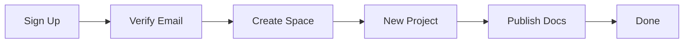

## Prerequisites

Before you begin, ensure you have the following:

<Callout kind="info">

- A valid email address for account verification
- Access to a modern web browser like Chrome, Firefox, or Safari
- Optional: A GitHub account if you plan to import repositories

</Callout>

## Create and Verify Your Account

Sign up for Arseniy Finberg in under a minute.

<Steps>
  <Step title="Visit the signup page" icon="external-link">
    Navigate to the [Arseniy Finberg signup page](https://app.arseniyfinberg.com/signup).
  </Step>
  <Step title="Enter your details" icon="user-plus">
    Provide your email address, create a strong password, and complete the CAPTCHA.
  </Step>
  <Step title="Verify your email" icon="mail">
    Check your inbox for a verification email from Arseniy Finberg and click the link to activate your account.
  </Step>
</Steps>

<Callout kind="tip">
  Enable two-factor authentication immediately after login for added security.
</Callout>

## Set Up Your Default Documentation Space

Your default space organizes all projects. Customize it during onboarding.

<Steps>
  <Step title="Complete onboarding" icon="check-circle">
    Log in and follow the guided tour to name your space, e.g., "My Project Docs".
  </Step>
  <Step title="Configure preferences" icon="settings">
    Set your brand color to `#3B82F6` and choose a theme in the space settings.
  </Step>
</Steps>

## Create Your First Project

Choose between starting fresh or importing existing content.

<Tabs>
  <Tab title="New Project" icon="plus">
    <Steps>
      <Step title="Create project" icon="file-plus">
        Click **New Project** in the dashboard and enter a name like "API Reference".
      </Step>
      <Step title="Add first page" icon="edit-3">
        Select **Add Page** and choose the `quickstart.mdx` template.
      </Step>
    </Steps>
  </Tab>
  <Tab title="Import from GitHub" icon="github">
    <Steps>
      <Step title="Connect GitHub" icon="link">
        Authorize Arseniy Finberg in GitHub settings.
      </Step>
      <Step title="Import repo" icon="download">
        Paste your repo URL, e.g., `https://github.com/yourusername/my-docs`, and select files to import.
      </Step>
    </Steps>

    <CodeGroup tabs="CLI,Web">
      ````bash
      # Use Arseniy Finberg CLI for advanced import
      npx @arseniyfinberg/cli import --repo yourusername/my-docs --token YOUR_GITHUB_TOKEN
      ````

      ````bash
      # Web import uses OAuth - no CLI needed
      echo "Use the dashboard for simplest import"
      ````
    </CodeGroup>
  </Tab>
</Tabs>

## Interface Tour

Familiarize yourself with the key areas.

<Columns cols={3}>
  <Card title="Dashboard" icon="layout-dashboard" href="#dashboard">
    Overview of spaces, projects, and recent activity.
  </Card>
  <Card title="Editor" icon="edit-3" href="#editor">
    Real-time MDX editor with live preview.
  </Card>
  <Card title="Publish" icon="globe" href="#publish">
    Deploy to custom domains or share links.
  </Card>
</Columns>

<Expandable title="Advanced Navigation Tips" default-open="false">

- Use the search bar (`Ctrl+K`) to find pages quickly.
- Sidebar shows page hierarchy; drag to reorganize.
- Preview mode toggles with `P`.

</Expandable>

## Next Steps

<Callout kind="success">
  Congratulations! You've set up Arseniy Finberg. Explore [authentication](/authentication) for team access or [changelog](/changelog) for updates.
</Callout>

